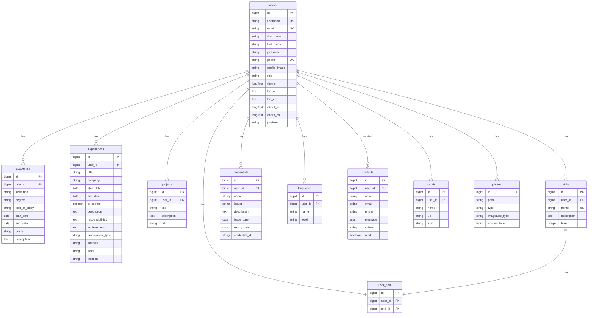

# توثيق API وقاعدة البيانات - CV API

## 📋 نظرة عامة

هذا المستند يحتوي على توثيق شامل لجميع API endpoints وبنية قاعدة البيانات الخاصة بمشروع CV API. سيتم استخدام هذه المعلومات في تطوير واجهة Frontend.

---

## 🔐 المصادقة (Authentication)

### Endpoints غير المحمية (Public)

| Method | Endpoint | الوصف | المعاملات المطلوبة |
|--------|----------|-------|-------------------|
| POST | `/api/register` | تسجيل مستخدم جديد | first_name, last_name, username, email, password |
| POST | `/api/login` | تسجيل الدخول | email, password |
| GET | `/api/users-all/{userName}` | عرض جميع بيانات المستخدم العامة | userName (في الرابط) |
| POST | `/api/contacts` | إرسال رسالة تواصل (عامة) | name, email, subject, message, phone?, user_id |

### Endpoints المحمية (Protected - require auth:sanctum)

| Method | Endpoint | الوصف |
|--------|----------|-------|
| POST | `/api/logout` | تسجيل الخروج |
| GET | `/api/me` | الحصول على بيانات المستخدم الحالي |

---

## 👤 Users API

**Base Path:** `/api/users`  
**Authentication:** Required (except users-all)

| Method | Endpoint | الوصف | المعاملات |
|--------|----------|-------|-----------|
| POST | `/api/users` | إنشاء مستخدم جديد | first_name, last_name, username, email, password |
| GET | `/api/users` | عرض جميع المستخدمين | - |
| GET | `/api/users/{id}` | عرض مستخدم محدد | id |
| PUT | `/api/users/{id}` | تحديث بيانات المستخدم | id + الحقول المراد تحديثها |
| PUT | `/api/users-theme/{id}` | تحديث theme المستخدم | id, theme |
| POST | `/api/users/delete` | حذف مستخدم | id (في body) |
| GET | `/api/reset-theme-all-users` | إعادة تعيين theme لجميع المستخدمين | - |

---

## 🎓 Academics API

**Base Path:** `/api/academics`  
**Authentication:** Required

| Method | Endpoint | الوصف | المعاملات |
|--------|----------|-------|-----------|
| POST | `/api/academics` | إضافة مؤهل دراسي | institution, degree, field_of_study, start_date, end_date?, grade?, description?, user_id |
| GET | `/api/academics` | عرض جميع المؤهلات | - |
| GET | `/api/academics/{id}` | عرض مؤهل محدد | id |
| PUT | `/api/academics/{id}` | تحديث مؤهل دراسي | id + الحقول المراد تحديثها |
| POST | `/api/academics/delete` | حذف مؤهل دراسي | id (في body) |

---

## 💼 Experiences API

**Base Path:** `/api/experiences`  
**Authentication:** Required

| Method | Endpoint | الوصف | المعاملات |
|--------|----------|-------|-----------|
| POST | `/api/experiences` | إضافة خبرة عملية | title, company, start_date, end_date?, is_current, description?, responsibilities?, achievements?, employment_type?, industry?, skills?, location?, user_id |
| GET | `/api/experiences` | عرض جميع الخبرات | - |
| GET | `/api/experiences/{id}` | عرض خبرة محددة | id |
| PUT | `/api/experiences/{id}` | تحديث خبرة عملية | id + الحقول المراد تحديثها |
| POST | `/api/experiences/delete` | حذف خبرة عملية | id (في body) |

---

## 📁 Projects API

**Base Path:** `/api/projects`  
**Authentication:** Required

| Method | Endpoint | الوصف | المعاملات |
|--------|----------|-------|-----------|
| POST | `/api/projects` | إضافة مشروع | title, description?, url?, user_id |
| GET | `/api/projects` | عرض جميع المشاريع | - |
| GET | `/api/projects/{id}` | عرض مشروع محدد | id |
| PUT | `/api/projects/{id}` | تحديث مشروع | id + الحقول المراد تحديثها |
| POST | `/api/projects/delete` | حذف مشروع | id (في body) |

---

## 🛠️ Skills API

**Base Path:** `/api/skills`  
**Authentication:** Required

| Method | Endpoint | الوصف | المعاملات |
|--------|----------|-------|-----------|
| POST | `/api/skills` | إضافة مهارة | name (unique), description?, level?, user_id |
| GET | `/api/skills` | عرض جميع المهارات | - |
| GET | `/api/skills/{id}` | عرض مهارة محددة | id |
| PUT | `/api/skills/{id}` | تحديث مهارة | id + الحقول المراد تحديثها |
| POST | `/api/skills/delete` | حذف مهارة | id (في body) |

---

## 🎖️ Credentials API

**Base Path:** `/api/credentials`  
**Authentication:** Required

| Method | Endpoint | الوصف | المعاملات |
|--------|----------|-------|-----------|
| POST | `/api/credentials` | إضافة شهادة | name, issuer, description?, issue_date, expiry_date?, credential_id?, user_id |
| GET | `/api/credentials` | عرض جميع الشهادات | - |
| GET | `/api/credentials/{id}` | عرض شهادة محددة | id |
| PUT | `/api/credentials/{id}` | تحديث شهادة | id + الحقول المراد تحديثها |
| POST | `/api/credentials/delete` | حذف شهادة | id (في body) |

---

## 🌍 Languages API

**Base Path:** `/api/languages`  
**Authentication:** Required

| Method | Endpoint | الوصف | المعاملات |
|--------|----------|-------|-----------|
| POST | `/api/languages` | إضافة لغة | name, level, user_id |
| GET | `/api/languages` | عرض جميع اللغات | - |
| GET | `/api/languages/{id}` | عرض لغة محددة | id |
| PUT | `/api/languages/{id}` | تحديث لغة | id + الحقول المراد تحديثها |
| POST | `/api/languages/delete` | حذف لغة | id (في body) |

---

## 📧 Contacts API

**Base Path:** `/api/contacts`  
**Authentication:** Required (except POST)

| Method | Endpoint | الوصف | المعاملات |
|--------|----------|-------|-----------|
| POST | `/api/contacts` | إرسال رسالة (عامة) | name, email, subject, message, phone?, user_id |
| GET | `/api/contacts` | عرض جميع الرسائل | - |
| GET | `/api/contacts-unread` | عدد الرسائل غير المقروءة | - |
| GET | `/api/contacts-mark-all-read` | تعليم جميع الرسائل كمقروءة | - |
| GET | `/api/contacts/{id}` | عرض رسالة محددة | id |
| PUT | `/api/contacts/{id}` | تحديث رسالة | id + الحقول المراد تحديثها |
| POST | `/api/contacts/delete` | حذف رسالة | id (في body) |

---

## 🔗 Socials API

**Base Path:** `/api/socials`  
**Authentication:** Required

| Method | Endpoint | الوصف | المعاملات |
|--------|----------|-------|-----------|
| POST | `/api/socials` | إضافة رابط اجتماعي | name?, url?, icon?, user_id |
| GET | `/api/socials` | عرض جميع الروابط | - |
| GET | `/api/socials/{id}` | عرض رابط محدد | id |
| PUT | `/api/socials/{id}` | تحديث رابط | id + الحقول المراد تحديثها |
| POST | `/api/socials/delete` | حذف رابط | id (في body) |

---

## 🎨 Themes API

**Base Path:** `/api/themes`  
**Authentication:** Required

| Method | Endpoint | الوصف | المعاملات |
|--------|----------|-------|-----------|
| POST | `/api/themes` | إضافة theme | - |
| GET | `/api/themes` | عرض جميع الـ themes | - |
| GET | `/api/themes/{id}` | عرض theme محدد | id |
| PUT | `/api/themes/{id}` | تحديث theme | id + الحقول المراد تحديثها |
| POST | `/api/themes/delete` | حذف theme | id (في body) |

---

## 📸 Photos API

**Base Path:** `/api/photo`  
**Authentication:** Required

| Method | Endpoint | الوصف | المعاملات |
|--------|----------|-------|-----------|
| DELETE | `/api/photo/{id}` | حذف صورة | id |

> ملاحظة: تم تعطيل endpoints الخاصة بـ POST, GET, PUT للصور (معلقة في الكود)

---

## 🗄️ بنية قاعدة البيانات

### 1️⃣ جدول `users`

الجدول الرئيسي للمستخدمين

| Column | Type | Attributes | الوصف |
|--------|------|-----------|-------|
| id | bigint | Primary, Auto | المعرف الفريد |
| first_name | string | nullable | الاسم الأول |
| last_name | string | nullable | اسم العائلة |
| username | string | unique | اسم المستخدم |
| email | string | unique | البريد الإلكتروني |
| password | string | - | كلمة المرور (مشفرة) |
| email_verified_at | timestamp | nullable | تاريخ التحقق من البريد |
| phone | string | nullable, unique | رقم الهاتف |
| address | string | nullable | العنوان |
| profile_image | string | nullable | صورة الملف الشخصي |
| role | string | default: 'user' | دور المستخدم |
| theme | longText | nullable | إعدادات الثيم (JSON) |
| bio_ar | text | nullable | نبذة قصيرة بالعربية |
| bio_en | text | nullable | نبذة قصيرة بالإنجليزية |
| about_ar | longText | nullable | نبذة تفصيلية بالعربية |
| about_en | longText | nullable | نبذة تفصيلية بالإنجليزية |
| position | string | nullable | المسمى الوظيفي |
| remember_token | string | nullable | - |
| created_at | timestamp | - | تاريخ الإنشاء |
| updated_at | timestamp | - | تاريخ التحديث |

---

### 2️⃣ جدول `academics`

المؤهلات الدراسية

| Column | Type | Attributes | الوصف |
|--------|------|-----------|-------|
| id | bigint | Primary, Auto | المعرف الفريد |
| institution | string | required | المؤسسة التعليمية |
| degree | string | required | الدرجة العلمية |
| field_of_study | string | required | مجال الدراسة |
| start_date | date | required | تاريخ البدء |
| end_date | date | nullable | تاريخ الانتهاء |
| grade | string | nullable | التقدير |
| description | text | nullable | الوصف |
| user_id | bigint | Foreign Key | معرف المستخدم |
| created_at | timestamp | - | تاريخ الإنشاء |
| updated_at | timestamp | - | تاريخ التحديث |

**العلاقات:**
- `user_id` → `users.id` (constrained)

---

### 3️⃣ جدول `experiences`

الخبرات العملية

| Column | Type | Attributes | الوصف |
|--------|------|-----------|-------|
| id | bigint | Primary, Auto | المعرف الفريد |
| title | string | required | المسمى الوظيفي |
| company | string | required | اسم الشركة |
| start_date | date | required | تاريخ البدء |
| end_date | date | nullable | تاريخ الانتهاء |
| is_current | boolean | default: false | هل لا يزال يعمل؟ |
| description | text | nullable | الوصف |
| responsibilities | text | nullable | المسؤوليات |
| achievements | text | nullable | الإنجازات |
| employment_type | string | nullable | نوع التوظيف (دوام كامل/جزئي) |
| industry | string | nullable | المجال |
| skills | string | nullable | المهارات المستخدمة |
| location | string | nullable | الموقع |
| user_id | bigint | Foreign Key | معرف المستخدم |
| created_at | timestamp | - | تاريخ الإنشاء |
| updated_at | timestamp | - | تاريخ التحديث |

**العلاقات:**
- `user_id` → `users.id` (constrained)

---

### 4️⃣ جدول `projects`

المشاريع

| Column | Type | Attributes | الوصف |
|--------|------|-----------|-------|
| id | bigint | Primary, Auto | المعرف الفريد |
| title | string | required | عنوان المشروع |
| description | text | nullable | وصف المشروع |
| url | string | nullable | رابط المشروع |
| user_id | bigint | Foreign Key | معرف المستخدم |
| created_at | timestamp | - | تاريخ الإنشاء |
| updated_at | timestamp | - | تاريخ التحديث |

**العلاقات:**
- `user_id` → `users.id` (constrained, onDelete: cascade)

---

### 5️⃣ جدول `skills`

المهارات

| Column | Type | Attributes | الوصف |
|--------|------|-----------|-------|
| id | bigint | Primary, Auto | المعرف الفريد |
| name | string | unique | اسم المهارة |
| description | text | nullable | وصف المهارة |
| level | integer | nullable | مستوى الإتقان (1-100) |
| user_id | bigint | Foreign Key | معرف المستخدم |
| created_at | timestamp | - | تاريخ الإنشاء |
| updated_at | timestamp | - | تاريخ التحديث |

**العلاقات:**
- `user_id` → `users.id` (constrained)

---

### 6️⃣ جدول `credentials`

الشهادات والاعتمادات

| Column | Type | Attributes | الوصف |
|--------|------|-----------|-------|
| id | bigint | Primary, Auto | المعرف الفريد |
| name | string | required | اسم الشهادة |
| issuer | string | required | المُصدِر |
| description | text | nullable | الوصف |
| issue_date | date | required | تاريخ الإصدار |
| expiry_date | date | nullable | تاريخ الانتهاء |
| credential_id | string | nullable | رقم الشهادة |
| user_id | bigint | Foreign Key | معرف المستخدم |
| created_at | timestamp | - | تاريخ الإنشاء |
| updated_at | timestamp | - | تاريخ التحديث |

**العلاقات:**
- `user_id` → `users.id` (constrained, onDelete: cascade)

---

### 7️⃣ جدول `languages`

اللغات

| Column | Type | Attributes | الوصف |
|--------|------|-----------|-------|
| id | bigint | Primary, Auto | المعرف الفريد |
| name | string | required | اسم اللغة |
| level | string | required | مستوى الإتقان |
| user_id | bigint | Foreign Key | معرف المستخدم |
| created_at | timestamp | - | تاريخ الإنشاء |
| updated_at | timestamp | - | تاريخ التحديث |

**العلاقات:**
- `user_id` → `users.id` (constrained, onDelete: cascade)

---

### 8️⃣ جدول `contacts`

رسائل التواصل

| Column | Type | Attributes | الوصف |
|--------|------|-----------|-------|
| id | bigint | Primary, Auto | المعرف الفريد |
| name | string | required | اسم المرسل |
| email | string | required | بريد المرسل |
| phone | string | nullable | هاتف المرسل |
| message | text | required | نص الرسالة |
| subject | string | required | الموضوع |
| read | boolean | default: false | هل تم قراءتها؟ |
| user_id | bigint | Foreign Key | معرف المستخدم المستقبل |
| created_at | timestamp | - | تاريخ الإنشاء |
| updated_at | timestamp | - | تاريخ التحديث |

**العلاقات:**
- `user_id` → `users.id` (constrained, onDelete: cascade)

---

### 9️⃣ جدول `socials`

روابط وسائل التواصل الاجتماعي

| Column | Type | Attributes | الوصف |
|--------|------|-----------|-------|
| id | bigint | Primary, Auto | المعرف الفريد |
| name | string | nullable | اسم المنصة |
| url | string | nullable | الرابط |
| icon | string | nullable | أيقونة المنصة |
| user_id | bigint | Foreign Key | معرف المستخدم |
| created_at | timestamp | - | تاريخ الإنشاء |
| updated_at | timestamp | - | تاريخ التحديث |

**العلاقات:**
- `user_id` → `users.id` (constrained)

---

### 🔟 جدول `photos`

الصور (Polymorphic Relation)

| Column | Type | Attributes | الوصف |
|--------|------|-----------|-------|
| id | bigint | Primary, Auto | المعرف الفريد |
| path | string | required | مسار الصورة |
| type | string | nullable | نوع الصورة |
| imageable_type | string | required | نوع الكيان المرتبط |
| imageable_id | bigint | required | معرف الكيان المرتبط |
| created_at | timestamp | - | تاريخ الإنشاء |
| updated_at | timestamp | - | تاريخ التحديث |

**العلاقات:**
- علاقة polymorphic تسمح بربط الصور بأي model (مثل User, Project, إلخ)
- Index على `(imageable_type, imageable_id)` للبحث السريع

---

### 1️⃣1️⃣ جدول `user_skill`

جدول وسيط (Many-to-Many)

| Column | Type | Attributes | الوصف |
|--------|------|-----------|-------|
| id | bigint | Primary, Auto | المعرف الفريد |
| user_id | bigint | Foreign Key | معرف المستخدم |
| skill_id | bigint | Foreign Key | معرف المهارة |
| created_at | timestamp | - | تاريخ الإنشاء |
| updated_at | timestamp | - | تاريخ التحديث |

**العلاقات:**
- `user_id` → `users.id` (constrained)
- `skill_id` → `skills.id` (constrained)

---

### 1️⃣2️⃣ جدول `themes`

الثيمات (فارغ حاليًا)

| Column | Type | Attributes | الوصف |
|--------|------|-----------|-------|
| id | bigint | Primary, Auto | المعرف الفريد |
| created_at | timestamp | - | تاريخ الإنشاء |
| updated_at | timestamp | - | تاريخ التحديث |

> ملاحظة: هذا الجدول لا يحتوي على حقول إضافية حاليًا، ربما يتم استخدامه لاحقًا

---

### 1️⃣3️⃣ جدول `profiles`

الملفات الشخصية (فارغ حاليًا)

| Column | Type | Attributes | الوصف |
|--------|------|-----------|-------|
| id | bigint | Primary, Auto | المعرف الفريد |
| created_at | timestamp | - | تاريخ الإنشاء |
| updated_at | timestamp | - | تاريخ التحديث |

> ملاحظة: هذا الجدول لا يحتوي على حقول إضافية حاليًا

---

### جداول النظام (Laravel System Tables)

#### `password_reset_tokens`
- email (primary)
- token
- created_at

#### `sessions`
- id (primary)
- user_id (foreign, nullable)
- ip_address
- user_agent
- payload
- last_activity

#### `personal_access_tokens` (Sanctum)
- id
- tokenable_type
- tokenable_id
- name
- token (unique)
- abilities
- last_used_at
- expires_at
- created_at
- updated_at

#### `cache` & `cache_locks`
جداول الـ caching

#### `jobs`, `job_batches`, `failed_jobs`
جداول الـ queues

---

## 🔗 مخطط العلاقات (ERD)



---

## 💡 ملاحظات هامة للـ Frontend

### 1. المصادقة (Authentication)
- استخدام **Laravel Sanctum** للمصادقة
- يجب حفظ الـ token بعد Login واستخدامه في جميع الطلبات المحمية
- إرسال الـ token في header: `Authorization: Bearer {token}`

### 2. الحقول ثنائية اللغة
في جدول `users` توجد حقول مكررة للعربية والإنجليزية:
- `bio_ar` / `bio_en` - النبذة القصيرة
- `about_ar` / `about_en` - النبذة التفصيلية

يجب على Frontend التعامل معها حسب اللغة المختارة.

### 3. الصور (Photos)
- نظام الصور يستخدم **Polymorphic Relationship**
- يمكن ربط الصور بأي model
- حقل `imageable_type` يحدد نوع الـ Model
- حقل `imageable_id` يحدد الـ ID الخاص بالـ record

### 4. التواريخ
- جميع الحقول من نوع `date` تستخدم صيغة `YYYY-MM-DD`
- الحقول من نوع `timestamp` تحتوي على التاريخ والوقت

### 5. الحذف
- معظم الـ endpoints تستخدم `POST /resource/delete` مع `id` في الـ body
- هذا ليس RESTful تمامًا لكنه التصميم المستخدم في الـ API

### 6. العلاقات One-to-Many
- كل مستخدم يمكن أن يكون لديه:
  - عدة مؤهلات دراسية (academics)
  - عدة خبرات عملية (experiences)
  - عدة مشاريع (projects)
  - عدة مهارات (skills)
  - عدة شهادات (credentials)
  - عدة لغات (languages)
  - عدة روابط اجتماعية (socials)
  - عدة رسائل تواصل (contacts)

### 7. الحقول المطلوبة vs الاختيارية
- راجع جداول التوثيق أعلاه
- الحقول `nullable` اختيارية
- باقي الحقول مطلوبة

### 8. Theme System
- الـ theme يتم حفظه كـ JSON في حقل `theme` في جدول `users`
- يمكن تحديثه باستخدام endpoint: `PUT /api/users-theme/{id}`

### 9. رسائل التواصل
- يمكن لأي شخص إرسال رسالة (endpoint عام)
- فقط صاحب الحساب يمكنه قراءة رسائله
- يوجد endpoint لعرض عدد الرسائل غير المقروءة

### 10. جداول فارغة
الجداول `profiles` و `themes` لا تحتوي على حقول إضافية حاليًا، ربما سيتم استخدامها لاحقًا.

---

## 🚀 أمثلة على الاستخدام

### مثال 1: تسجيل الدخول

```javascript
// Request
POST /api/login
Content-Type: application/json

{
  "email": "user@example.com",
  "password": "password123"
}

// Response
{
  "token": "1|abc123...",
  "user": {
    "id": 1,
    "username": "johndoe",
    "email": "user@example.com",
    ...
  }
}
```

### مثال 2: إضافة خبرة عملية

```javascript
// Request
POST /api/experiences
Authorization: Bearer {token}
Content-Type: application/json

{
  "title": "Senior Developer",
  "company": "Tech Company",
  "start_date": "2020-01-01",
  "end_date": null,
  "is_current": true,
  "description": "Working on cool projects",
  "user_id": 1
}

// Response
{
  "id": 5,
  "title": "Senior Developer",
  "company": "Tech Company",
  ...
}
```

### مثال 3: عرض بيانات مستخدم عامة

```javascript
// Request
GET /api/users-all/johndoe

// Response
{
  "user": {
    "id": 1,
    "username": "johndoe",
    "first_name": "John",
    "last_name": "Doe",
    "bio_ar": "...",
    "bio_en": "...",
    ...
  },
  "academics": [...],
  "experiences": [...],
  "projects": [...],
  "skills": [...],
  "credentials": [...],
  "languages": [...],
  "socials": [...]
}
```

---

## ✅ ملخص

هذا التوثيق يغطي:
- ✅ جميع الـ API Endpoints (48 endpoint)
- ✅ جميع الجداول (13 جدول رئيسي)
- ✅ جميع الحقول وأنواعها
- ✅ العلاقات بين الجداول
- ✅ ملاحظات للاستخدام في Frontend
- ✅ أمثلة عملية

يمكنك الآن البدء في تطوير Frontend باستخدام هذه المعلومات! 🎉
